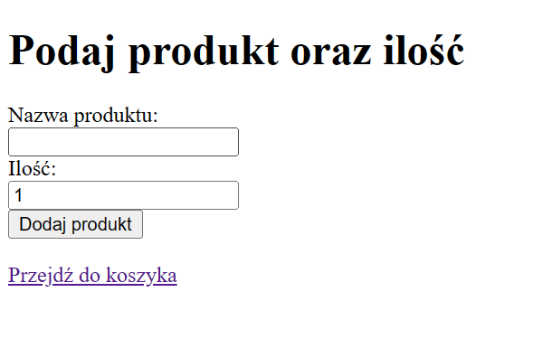

# Zadanie 3 - lista zakupów

Aplikacja Flask do zarządzania listą zakupów pozwala użytkownikom dodawać produkty do listy zakupów oraz przeglądać zawartość listy.

## Opis zadania

1. Dodawanie produktów: Użytkownicy mogą dodawać nowe produkty do listy zakupów poprzez formularz na stronie głównej oraz potrzebną ilośc prodktów.



2. Przeglądanie listy zakupów: Użytkownicy mogą przeglądać listę zakupów na stronie `basket`, gdzie wyświetlane są wszystkie dodane produkty wraz z ich ilością.


## Baza danych

Aplikacja korzysta z bazy danych SQLite, która przechowuje informacje o dodanych produktach. Baza danych jest tworzona automatycznie przy pierwszym uruchomieniu aplikacji.

## Instalacja

1. Zainstaluj wszystkie wymagane zależności, wykonując polecenie:

```bash
pip install flask
```

```bash
pip install sqlalchemy
```
